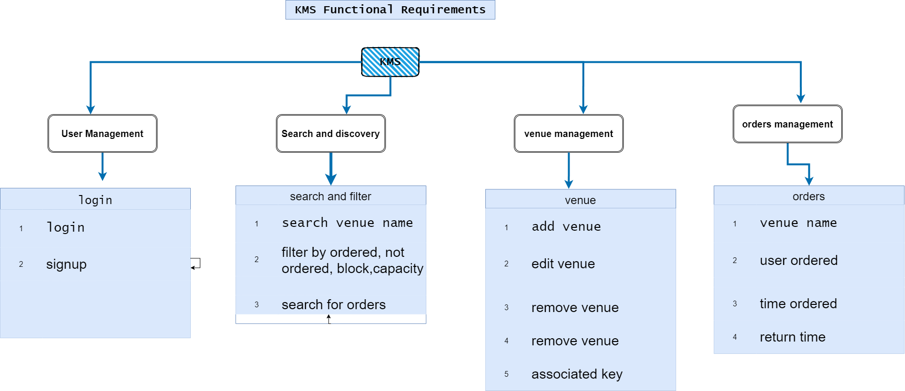

# Functional Requirements

This section outlines the functional requirements of the system, highlighting the goals and objectives the system aims to achieve. Below is a list of the functionalities the website will provide.

## User Management

- The user management system of KMS allows users to `log in` and `create accounts`. However, account creation will be managed by an admin.

## Search and Discovery

- Users will be able to search for venues and orders on the website. They can filter venues based on capacity, block, and name.

## Venue Management

- Only admins will have the ability to add, edit, and delete venue details within the system.

## Order Management

- Employees will be able to create, edit, delete, and update orders on the website.

## Fingerprint Management

- When a student requests to create an order, their user card will be scanned to retrieve their information. This will determine whether the student is eligible to request a key.
