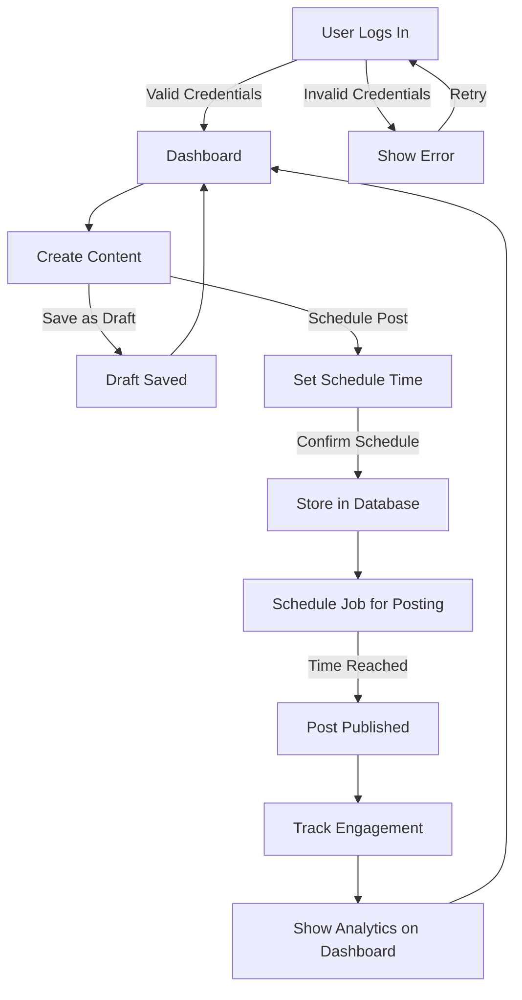

```mermaid
graph TD;
    A[User Logs In] -->|Valid Credentials| B[Dashboard];
    A -->|Invalid Credentials| C[Show Error];

    B --> D[Create Content];
    D -->|Save as Draft| E[Draft Saved];
    D -->|Schedule Post| F[Set Schedule Time];
    
    F -->|Confirm Schedule| G[Store in Database];
    G --> H[Schedule Job for Posting];
    
    H -->|Time Reached| I[Post Published];
    I --> J[Track Engagement];

    J --> K[Show Analytics on Dashboard];
    
    C -->|Retry| A;
    E --> B;
    K --> B;
```