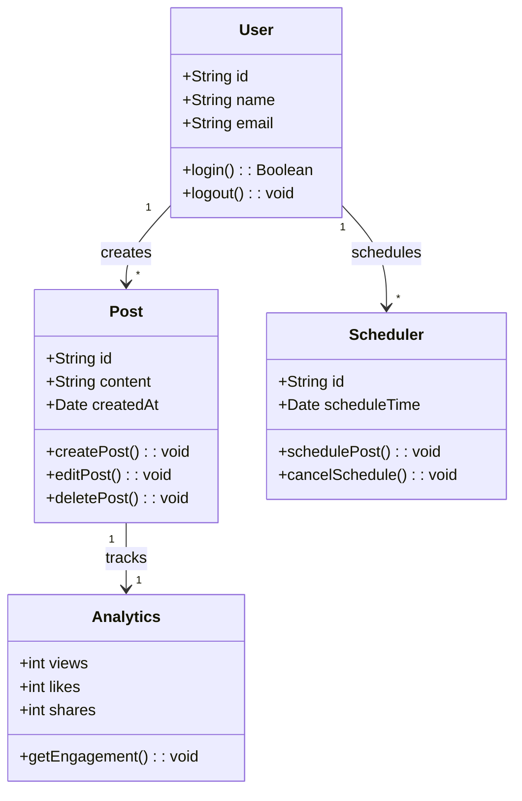

Here’s a **sample UML class diagram** in Markdown using **Mermaid**, which is supported in platforms like GitHub, Notion, and some documentation tools.  

### **Example: UML Class Diagram**


```
### **Explanation of the Diagram**
1. **Classes Defined**:
   - `User` (has attributes like `id`, `name`, `email` and methods like `login()`, `logout()`)
   - `Post` (represents content created by users)
   - `Scheduler` (handles post scheduling)
   - `Analytics` (tracks post engagement)

2. **Relationships**:
   - A **User** can create multiple **Posts** (`1 --> *`).
   - A **User** can schedule multiple **Posts** (`1 --> *`).
   - A **Post** is linked to **Analytics** (engagement tracking).

Let me know if you need different UML diagrams like **Use Case, Sequence, or Activity Diagrams**! 🚀